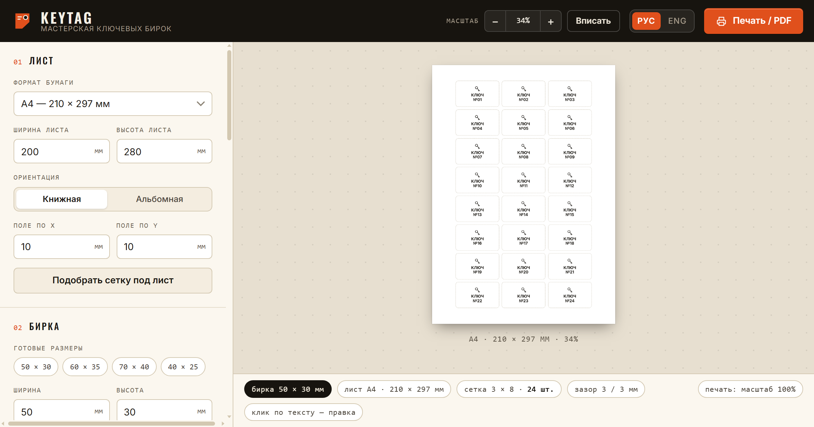

# KEYTAG

Редактор сеток ключевых бирок: одинаковые прямоугольники с реальными размерами в миллиметрах, текст и иконка внутри каждого, точная печать. Статический сайт — без сборки, без зависимостей, без бэкенда.

Онлайн: <https://keytag.guilliman.ru/>



## Быстрый старт

1. Откройте `index.html` в браузере — двойного клика достаточно, сервер не нужен.
2. Задайте размер бирки (например, 50 × 30 мм) и нажмите **«Подобрать сетку под лист»**.
3. Отредактируйте текст, выберите шрифт и иконку.
4. **«Печать / PDF»** → в диалоге печати масштаб **100%**, поля **«нет»** (или сразу «Сохранить как PDF»).

Если удобнее через локальный сервер:

```bash
python -m http.server 8000
# или
npx http-server -p 8000
```

## Возможности

- **Точные мм-размеры.** Ширина, высота, зазоры, скругление, поля листа — всё задаётся в миллиметрах и рисуется в миллиметрах. Экран только масштабируется (зум 20–300% и «Вписать»), печать всегда идёт в 1:1.
- **Листы.** A4, A3, Letter, Legal или свой размер; книжная/альбомная ориентация; поля по X и Y; кнопка автоподбора сетки под лист и пресеты бирок 50×30, 60×35, 70×40, 40×25.
- **Текст.** Шаблон с переносами строк, кегль в мм, 12 шрифтов (Inter, Oswald, Roboto Condensed, Montserrat, Unbounded, PT Serif, Playfair Display, Caveat + системные), насыщенность, выравнивание, трекинг, интерлиньяж, регистр, цвет.
- **Правка отдельной бирки.** Клик по тексту прямо на бирке правит только её: появляется маркер и кнопка `↺` со сбросом на шаблон. Остальные бирки продолжают жить по шаблону.
- **Иконки.** 20 встроенных векторных иконок (ключ, дом, офис, авто, склад, питомец и т. д.) плюс загрузка своей SVG/PNG; размер в мм, положение слева/сверху/справа, цвет наследуется от текста.
- **Нумерация.** Стартовое число и разрядность: `№007`, `№008`…
- **Направляющие и линия реза.** Пунктир, сплошная или без линии; направляющие внутри бирки показываются на экране и в печать не попадают.
- **Печать/PDF.** Размер страницы в `@page` подставляется под текущий формат и ориентацию; интерфейс, тени и направляющие в печати скрываются.
- **Русский/English** и автосохранение всех настроек в браузере.

## Шаблон текста

| Плейсхолдер | Подставляется |
|-------------|---------------|
| `{n}` | номер бирки с учётом старта и разрядности |
| `{total}` | общее число бирок на листе |

Пример: `КЛЮЧ\n№{n}` при старте `7` и разрядности `3` даёт `№007`.

## Печать

Кнопка печати формирует правило `@page` под текущий лист:

```css
@page { size: 210mm 297mm; margin: 0; }
```

Чтобы бирки совпали с реальным размером, в диалоге печати браузера выберите **масштаб 100%** и **без полей**. Поля листа задаются внутри редактора, поэтому системные поля печати не нужны. Для «виртуальной» печати выбирайте «Сохранить как PDF».

## Структура

| Файл | Назначение |
|------|------------|
| `index.html` | разметка: шапка, панель из пяти секций, холст с листом |
| `styles.css` | оформление, мм-геометрия, правила печати, адаптив |
| `app.js` | состояние, рендер сетки, зум, правки, печать |
| `i18n.js` | словари RU/EN (73 ключа) |
| `icons.js` | 20 встроенных иконок |
| `.gitignore` | мусор ОС и файлы редакторов |

Никаких сборщиков: обычные `<script>` без модулей, поэтому страница открывается и с `file://`.

## Хранилище

Настройки и правки текстов сохраняются в `localStorage` под ключом `keytag.studio.v1` (с задержкой 250 мс). Очистка данных сайта сбрасывает всё, кроме файлов репозитория.

## Браузеры и шрифты

Актуальные Chrome, Edge, Firefox, Safari. Web-шрифты подключаются из Google Fonts: без интернета бирки переключаются на системные фолбэки (`sans-serif`/`serif`/`cursive`), редактор остаётся работоспособным.

## Публикация

Домен прописан в `CNAME` (`keytag.guilliman.ru`), корень репозитория раздаётся как статический сайт (GitHub Pages). Абсолютные ссылки в OpenGraph указывают на этот домен — при переезде поправьте `og:url`, `og:image` и `canonical` в `index.html`.

## Автор

© 2026 Herman Guilliman

## Что проверено

Геометрия (лист A4 = 793.7 × 1122.5 px = 210 × 297 мм, бирка 50 × 30 мм = 189.0 × 113.4 px, кегль 4.5 мм = 17.01 px), размер страницы у реального PDF (595 × 842 pt, в альбомной — наоборот), скрытие интерфейса в печати, правка и сброс отдельных бирок, переключение языка, загрузка своей иконки, автосохранение после перезагрузки, отсутствие ошибок в консоли, подписи у полей ввода, отсутствие горизонтального скролла на 390 px.
